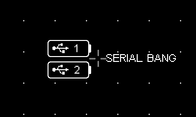

# Modular Play for Playdate

## About

Modular Play is a casual playground game on [Playdate](https://play.date) for building little music making patches by connecting modules with cables. It's meant to be fun and not really for serious use but it can create some beautiful music.

Itch.io link: [orllewin.itch.io/modularplay](https://orllewin.itch.io/modularplay)

# Building

Download the Playdate SDK: [sdk.play.date](https://sdk.play.date/) and install [Nova](https://nova.app/). Open the repo in Nova and activate the *Playdate Simulator* task in Project Settings.

# Contributing

This beast of a project (30k+ LOC) grew from a basic proof-of-concept where cables were dragged between a few modules and events propagated from one to another. The original developer did/does not know Lua well which should be obvious to anyone browsing the code. 

Each module follows some basic conventions instead of having tight contracts/interfaces (which may or may not be possible in Lua, I have no idea, I was having too much fun building this thing and didn't think to learn Lua properly), when hunting the root cause of bugs 90% can be found in a bad implementation of some core ideas, most likely they fail to detach a cable properly when deleting an attached module leaving things in a broken state (a lot of bugs can be replicated by following steps reported by users that generally involve adding, then deleting, a certain module). 

The save/load process is also a likely source of lots of bugs - modules serialise themselves to json and back again, any missteps in that logic will leave a newly opened patch in a bad state. 

Modular Play _really_ pushes the Playdate - as well as wrapping the audio engine the ui is complex and patches can have a few dozen modules each with multiple cables all in a scrollable canvas. Redraws should be minimised as much as possible (even down to step size on rotary encoders), and new modules should perform well as part of a larger patch. Live updates to the module ui should be avoided where possible to minimise the redraw load. 

The 'Granular' module is the latest (and buggiest) module, it's a good example of what not to do, has too much ui refreshing. In fact if I was doing this again I'd limit sample handling to a single simple module that plays a single sample when triggered, nothing more.  

The project will continue to be sold at [orllewin.itch.io/modularplay](https://orllewin.itch.io/modularplay) but for a reduced price (TBD, probably £5). **Licence also TBD**. If anyone contributes significantly I'm open to some kind of informal profit sharing in the future (but honestly it doesn't make much).   

## Modules

Each module has a parent `module_mod.lua` with a child `module_component.lua`. The module should generally handle ui, with the component handling the core functionality (clock events, audio, effects etc). 

### init

Each module has a init method with an x,y coordinate and a nullable modId:

```
function MyModule:init(xx, yy, modId)
  MyModule.super.init(self)
  
  if modId == nil then
    self.modId = modType .. playdate.getSecondsSinceEpoch()
  else
    self.modId = modId
  end
  
  ...
```

The modId is passed when resurrecting a module from a save file, otherwise a new unique Id is created (mod type plus epoch seconds). The rest of `init` depends on the module but as much of the ui should be pre-calculated here as possible. 

### turn

If the module has controls that can be cranked if should have a `turn` method with `x`, `y`, `change` parameters. The coordinates are used where a module has multiple encoders, so it can find which is closest to the global caret.

### handleModClick

Same as above. To handle button clicks, and also displaying the module menu.

### tryConnectGhostIn, tryConnectGhostOut

Cables are 'ghosts' before they're reified. The system will try and connect a ghost cable to the nearest socket and do some validation (is the signal type correct (you can't connect audio to a clock for example), are all sockets occupied already etc), using the Blackhole mod as an example:

```
function BlackholeMod:tryConnectGhostIn(x, y, ghostCable, sourceSubtype, onError)
  if sourceSubtype ~= "clock_router" and sourceSubtype ~= "midi" then 
    if onError ~= nil then onError("This input requires a clock or midi signal") end
    return false 
  elseif ghostCable:getStartModId() == self.modId then
    print("Can't connect a mod to itself...")
    return false
  elseif self.component:inConnected() then
    return false 
  else
    ghostCable:setEnd(self.socketInVector.x, self.socketInVector.y)
    ghostCable:setGhostReceiveConnected()
    return true
  end
end
```

### setInCable, setOutCable

When a cable is dropped with both its start and end connected the ghost cable becomes reified. 

### evaporate

When a module is deleted its `evaporate` method is called, the module should clean up here, calling any attached modules using the `onDetachConnected` callback with each cable (each attached module will have its `unplug` method called with a cable id, see below). Example from the main clock module:

```
function Clock2Mod:evaporate(onDetachConnected)
  print("Clock2Mod evaporate removing cables")
  self.component:stop()
  --first detach cables
  if self.component:aConnected() then
    onDetachConnected(self.outACable:getEndModId(), self.outACable:getCableId())
    self.component:unplugA()
    self.outACable:evaporate()
  end
  
  if self.component:bConnected() then
    onDetachConnected(self.outBCable:getEndModId(), self.outBCable:getCableId())
    self.component:unplugB()
    self.outBCable:evaporate()
  end
  
  if self.component:cConnected() then
    onDetachConnected(self.outCCable:getEndModId(), self.outCCable:getCableId())
    self.component:unplugC()
    self.outCCable:evaporate()
  end
  
  if self.component:dConnected() then
    onDetachConnected(self.outDCable:getEndModId(), self.outDCable:getCableId())
    self.component:unplugC()
    self.outDCable:evaporate()
  end
  
  --then remove sprites
  self.clockEncoder:evaporate()
  playdate.graphics.sprite.removeSprites({self.labelSprite})
  self.clockEncoder = nil
  self.labelSprite = nil
  self:remove()
end
```

### unplug

When a module is deleted all its attached modules should be told to unplug their connected cables first - this lets connected modules set themselves back into a suitable state. 

### ghostModule

When adding a new module it should generate a lightweight 'ghost' sprite so the user can position it on-screen without drawing all child elements/sprites. 

### toState, fromState

`toState` describes a module as a JSON object so it can be saved. This includes everything needed to resurrect it. Likewise `fromState` has a JSON object argument that should contain everything needed to resurrect itself. Here be dragons and a likely cause of bugs.

---

### Audio

Adding and removing audio modules is particularly complex; Modular Play is a wrapper around the Playdate audio engine, adding and removing effects and audio sources out of sequence creates a tricky problem where the system needs to propagate up and down the chain of modules and cables. Another source of bugs, there's plenty of improvements to be made here.


### Cable Routing

Module subtypes:
* `clock_router` - something that manipulates and emits clock signals
* `midi` - something that outputs midi notes
* `audio_gen` - something that makes sound, a synth or effect
* `audio_effect` - something that can receive audio, and also outputs audio
* `other` - something else

Some basic checks are done by the module manager to see if cables can be routed without asking the modules:

```
-- Audio sources can't output to clocks or sequencers
if self.cableOriginModSubtype == "audio_gen" and module.modSubtype == "clock_router" then return end
if self.cableOriginModSubtype == "audio_gen" and module.modSubtype == "midi" then return end
if self.cableOriginModSubtype == "audio_effect" and module.modSubtype == "clock_router" then return end
if self.cableOriginModSubtype == "audio_effect" and module.modSubtype == "midi" then return end
```

`tryConnectGhostOut` now has an additional final argument: `outConnect = module:tryConnectGhostIn(x, y, self.ghostCable, self.cableOriginModSubtype)`

The `cableOriginModSubtype` tells the target module what's at the other end of the cable, so it can decide whether it will allow the connection or not. Unfortunately this needs doing manually in every module and there's 40+ of them. It needs to be done this way because some modules might accept multiple input types.  eg. an effect may have an audio input, as well as value inputs to automate encoder turning.

### Misc

`find . -name '*.lua' | xargs wc -l` - get lines of code in the project

|  |  |
| --- | --- |
|  |  |

---

## Use Headphones

**Important**: Modular Play needs to be used with external speakers of some kind, either with headphones or as part of a bigger music-making setup. The in-built Playdate speaker is tiny and has a very narrow range of usable frequencies.

## Volume

**Important**: The Playdate audio engine is additive - if you have 5 audio sources each should be set to have a volume of around 2 to avoid clipping. You get used to it, but it's painful at first.


Screenshots on this site might include unfinished or older versions of modules.

## Found a bug?

This is a complex piece of software, there will be bugs, especially in the Alpha and Beta releases. If you find an issue [comment in the itch.io community thread](https://itch.io/t/3248289/bug-reports)

# General Info and Instructions

- When you tap (A) in empty space a context menu appears where you can navigate around all the available patch options: save, load, delete, and browse all the module categories. (A) drills down into a menu until you hit a leaf node. (B) closes and dismisses the menu with no action.
- If you tap (B) on a module and there's an empty out socket a cable will appear to plug into somewhere else - move around the patch space to another module and tap (B) again to connect the two together. Modules will generally use the next available input or output. Some modules will use whichever in or out socket is closest when you tap (B) (Unplugging individual cables isn't supported yet, you'll need to delete a module, then reconnect the cables, it's a complex feature and needs to be developed down the line).
- Tapping (B) in empty space zooms the interface. The Playdate screen is quite small so this can help a lot, get used to using it.
- While moving around patch space with the direction pad if you hold down (B) the speed increases a lot. If you have a large patch this is invaluable.
- You can invert the screen in `System > Invert Screen` (fixed in 0.0.10 Alpha, coming soon)
- There are some sound effects when adding modules and cables, you can turn these off in `System > Sound Effects Off`
- **Remember you can set the global Playdate volume from anywhere by holding the main yellow menu button and pressing left and right.**
- If you want to share a screenshot of a patch go to `System > Screenshot`, this will hide the reticle cross and pan around the patch capturing screenshots before stitching them together (see the patch images on this page). The screenshot is saved under `Disk/Data/orllewin.playdate.modularplay/images` - you'll need to put your Playdate into mass storage mode and copy the images from your computer. Alternatively you can run Modular Play in the Playdate simulator where the images are easily retrieved from the simulator menu (on MacOS: `Playdate Simulator > Reveal Data folder in Finder)`
- Patches are saved in `.orlam` files, you can share patches by putting the Playdate into mass storage mode and finding the files under `Disk/Data/orllewin.playdate.modularplay/`.  
      
    _Trivia: .orlam stands for Orllewin Analog Modular, which is what this project used to be called before I settled on Modular Play._
    


# Modules

Most of the included modules (newer ones aren't here), in the order they appear in the main menu (a popup that appears when you tap (A) in empty space)

# Clock

## Clock


The first module you'll add to most patches, generates a periodic 'bang' that's passed from module to module until it finds something that transforms clock events to a midi note or controls some other parameter. There's a single encoder to control the tempo, and four sockets to connect to other clock routing modules.

## Bubble Chamber


Balls/Particles/Molecules bounce around a box, when they hit the sides a clock event is emitted. Change the velocity and add and remove balls from the menu to change the random tempo.

## Clock Delay


Randomly holds on to a note for a precise interval, the chance of this happening controlled by the right-hand encoder. Useful for adding a little randomness to sequenced melodies and drum patterns.

## Clock Divider


Swallows every other clock event, halving the tempo.

# Core

## Midi Keyboard


Emits midi notes. Not practical but useful for trying out synth sounds quickly. Try _System > Midi/Serial Input_ with external hardware instead.

## Pedal

 

Emits a single event when pressed, and another when released. Used for controlling the sampler, or toggling a switch. The default mode emulates a momentary pedal: fires an event when pressed and another when released. To switch modes tap the top header area where you can change the pedal to fire a single event when clicked.

## Random


Emits a random number from 0.0 to 1.0 when it receives a bang. Limited use currently.

## Oscillator


Pseudo-oscillator for controlling various parameters. Top encoder controls centre position (in range 0.0 to 1.0), middle encoder controls width (0.0 to 1.0), and bottom encoder sets the period.

## Oscillator 2


Same as Oscillator but uses less space on the screen, switch between encoders by tapping and selecting from the popup menu.

## Bifurcate x2


Splits a clock signal into two allowing you to extend your patch. Can be rotated via a menu option before the first cable is connected.

## Bifurcate x4


As above but splits a clock signal into four.

## Blackhole


Swallows events. Encoder controls gravity, the higher the gravity the lower the chance an event will escape.

## XY Tilt


Physically tilt your Playdate to emit events along the X and Y axis. Useful for live control of synth parameters. This is a fairly intensive module so limit to one per patch if possible.

## Y Tilt


Same as XY Tilt but only operates on the Y axis.

## Print/Log


Displays event value and relays it on to next module. Only really useful for debugging.

# Sequencing

## Generative Standard

  

A key module, Generative combines a handful of modules internally, when it receives a clock event it decides whether to delay the bang, maybe swallow it in a black hole, and then converts it to a random midi note in the given scale. Combine in a simple patch with a Clock, a Synth, and a Speaker/Output to generate a random arpeggiated sequence.

## Generative Random

  

Combines Bubble Chamber with the logic of Generative Standard: every time a ball/particle/molecule hits a wall a random note is emitted from the selected scale.

## Arpseq


A traditional 'piano roll'/'swimlane' arpeggiator style sequencer. Create short melodies/hooks in otherwise random patches. Works well with Bubble Chamber as a clock event source.

## Micro Sequencer


16 step sequencer. Write simple melodies. Put a Clock Delay and/or Blackhole before this module to add some variation to timings. A more versatile variable step sequencer is under development, not quite ready for the Alpha release.

## Drone Seq


Emits up to four midi notes which never turn off. Combine with a synth with automated parameters to generate unending evolving drones. If you change a synth preset you'll need to re-trigger the note in this module.

# Midi/Seq Utils

## Random Repeater

 

Spread midi note events across multiple synths; when a note event is received it's emitted at one of the connected output sockets, chosen at random

## Random Shifter


When Random Shifter receives a midi note event it randomly decides whether to emit at the original pitch, up and octave, or down an octave - each with 33.3% probability.

## Linear Switch


Control if clock events reach a section of your patch with a Linear Switch, can be toggled manually or automated with the bottom socket.

## Dual Switch

 

Switch between two different paths, can be toggled manually or automated with the bottom socket.

## Timed Switch


Automate toggling areas of your patch with a timed switch controlled by a number of clock events. `mm.` is musical notation for a bar. Use a Timed Switch to automate a Dual Switch to move between two areas of a patch every n bars.

# Drum Machines

## Orl Drum Machine

 

A 16 step drum machine. Use the encoders to choose from the built-in 606, 808, and 909 sample sets. Use a Clock Delay and/or Blackhole to add randomness to your patterns.

## OR-606

 

A simple emulation of the classic Roland TR-606.

## OR-808


A simple emulation of the classic Roland TR-808.

## OR-909

A simple emulation of the classic Roland TR-909.

# Synths

## Wavetable


A wavetable synth with a single dimension modifier. This allows you to morph the sound in the X axis. The axis position can be automated with one of the accelerometer modules or an oscillator.

## 2D Wavetable


Same as Wavetable but allows morphing the sound across the X and Y axis.

## ORL Sample Synth


A simple synth that pitches samples to midi notes. There's a variety of built-in categories but you can also use your own samples (record samples tuned to C with the Sampler module), this is limited somewhat by the gain of the condenser microphone, a method to import pre-recorded WAVs will come soon.

## ORL Synth


A basic synth with the usual waveform primitives (Sine, Square, Triangle, Saw) plus three Teenage Engineering presets from their Pocket Operator series. The Teenage Engineering synths have two additional parameters which can be automated from the two input sockets

## Noise Box


Generates evolving noise. Internally a low-pass filter with oscillator modulates the sound.

## Micro synth


Same sounds as the Orl Synth but without envelope or parameter controls, tap to open the menu and change the waveform. Useful for larger patches with multiple synths to lower the strain on the processor (it uses less resources to draw).

## Stochastic Primitives


A trio of synth modules developed for use in the onboarding/introduction patches. Internally they have a simple synth controlled by a random number generator, clock delay, a blackhole and a delay effect, they play random melodies in C Major.

## Wavetable Sigen


Another test module that's been left in, was used to debug x-axis wavetable interpolation. Sounds awful.

# Sampling

## Sample Record


Records audio from the Playdate internal microphone. Can be toggled with a menu item, or combine with a Pedal module. There's a built-in sampler patch `File > Load > Sample` for this purpose, the module is quite processor heavy so shouldn't be used as part of another patch. Currently you need to delete samples with a computer via a USB cable and putting the Playdate into storage mode, sample management will be added in the future to simplify things.

## Sample Play


Play back recorded samples. The encoders control start point, end point, and pitch. There's an in socket for use with the Pedal module or automation.

## Hexagram


A Modular Play implementation of the Hexagram Playdate app. This is very powerful but can summon demons. It records samples in a circular buffer and plays subsamples back at different pitches and randomly reversed. Allow it to record for a while then switch to idle mode to prevent excessive sampling of it's own output. There's a built-in patch to use Hexagram as a live effect in a larger hardware setup in `File > Load > Hexagram`

# Effects

## Krush

 

A Bitcrusher. Controls are 'amount', 'undersampling', and 'mix'. Use to add some dirt to drums and drones.

## Delay


A Delay. Controls are 'time', 'feedback', and 'mix'. I use this a lot.

## Lo-Pass


A low-pass filter. Controls are 'frequency', 'resonance', and 'mix'.

## Hi-Pass


A high-pass filter. Controls are 'frequency', 'resonance', and 'mix'.

## Overdrive


Overdrive. Controls are 'gain', 'limit', and 'mix'. Can also be used to make quiet recorded samples louder.

## Ring Modulator


A ring modulator. Controls are 'frequency' and 'mix'. Sounds awful.

# Output

_All outputs mimic a real-world amp and speaker. The Playdate audio engine is additive - if you have 5 audio sources each should be set to have a volume of around 2 to avoid clipping. You get used to it, but it's painful at first. I could treat this as an implementation detail where it's all done behind the scenes but it's a lot of effort to code._

## Basic Output


A speaker. You can change the volume by tapping to open the menu.

## Single Output


Same as Basic Output but there's an on-screen encoder for the volume. We don't really need two but earlier in development on-screen encoders had a performance overhead, that's been fixed but both modules remain.

## 4 Channel


A 4 channel mixer. Makes managing volumes easier than having single/basic output modules everywhere (remember there's a performance overhead with long cables though).

## 4 Channel Pro


Similar as the 4 Channel mixer but with encoders to control left-right panning, the bottom of the module has four input sockets to automate volume - this is useful for fading parts of a patch in and out, especially good for drones.

# UI

_These modules were added for the built-in introduction patches but they're still available so you can customise areas of your patches._

## Label


A small label using the default Modular Play font. When you add the module an on-screen keyboard is displayed so you can add your text.

## Large Label


As above, but with larger font and no border.

## Label Arrow


To point at things, use together with the text labels.

# Serial Interface

## Serial Bang Input



Receives a `msg b1` event over the serial interface where the number is a value from 1 to 16.  Each Serial Bang module can be assigned a bang ID from 1 to 16 from its menu. Useful for triggering.

*Note. if implementing your own host app be sure to send `\n` to terminate the serial command. eg. `msg b2\n`. 
# System

The system menu contains various system-wide toggles as well as a couple of modules.

## Midi/Serial Input


For use with external hardware - more on this soon.  
_Will not work with standard USB Midi, though it'd be amazing if Panic added support for that._

# Planned Roadmap

Although the Alpha is a paid app on itch.io you'll get all future upgrades and improvements. **Only purchase if you understand there will be rough edges and occasional crashes** - there are no refunds unless the software is utterly non-functional.

- 28/10/2023: 0.0.9 Alpha - initial release for early adopters, will have too many bugs, some unfinished modules are hidden. Here be dragons.
- 0.0.10 .. 0.0.n Alphas - patch releases with regular fixes over the first month or two, including adding currently unfinished new modules.
- 0.1.0 Beta - a release candidate, approaching stability.
- 1.0.0 - Fewer unwelcome surprises.
- ?.?.? - Desktop midi to serial bus.
- ?.?.? - Companion Android app (code will be freely available if anyone wants to port to iOS, I may try myself if I can find the time).
- ?.?.? - Hardware foot pedal project with instructions and code for recording samples.

# Performance and Limitations

_This is lengthy and won't be of interest for everyone, if you just want to make nice melodies while sitting on the train or whatever you can skip all of the information below._

The Playdate does incredibly well considering how tiny it is, and for most patches it'll perform fine without extra steps, but on larger patches with dozens of modules and automation you will get some UI slowdown; the bigger the patch the bigger the performance hit. Thankfully the audio fidelity isn't impacted, there's no audible artefacts, but the clock may emit slower occasionally making syncing to external sequenced music impossible. I've spent a lot of time optimising the modules themselves but one easy thing you can do to minimise the amount of work done when rendering the patches is to keep the length of cables sensible, if a cable is wider than the screen you're likely to see some performance issues if the patch is doing lots of other work too.

Modular Play is primarily a wrapper around the Playdate's audio API, it's not a true simulation of a modular synth setup in that you can't route signals wherever you like. Once audio leaves a synth it can only be routed through effects modules before finally escaping to your ear via one of the amp/speaker modules. The clock bangs are however produced within Modular Play and can be manipulated however we like. You should be prevented from doing things that don't work in Modular Play, like routing a clock signal into an audio-in socket, but there may be missing logic in some modules; if you find anything that doesn't seem correct [raise an issue](https://github.com/orllewin/modular_play_public/issues).

Another limitation of the Playdate is that audio input can only be done by the built-in condenser microphone and the levels may be fairly low compared to the output of the synths. The Playdate should be able to record from a line-in with a TRRS cable but this has been broken since launch and there's no sign of a fix yet. I will try and offer a desktop 'WAV to Playdate audio' utility if you want to use your own samples instead of recording with the Sample Record module.
 
